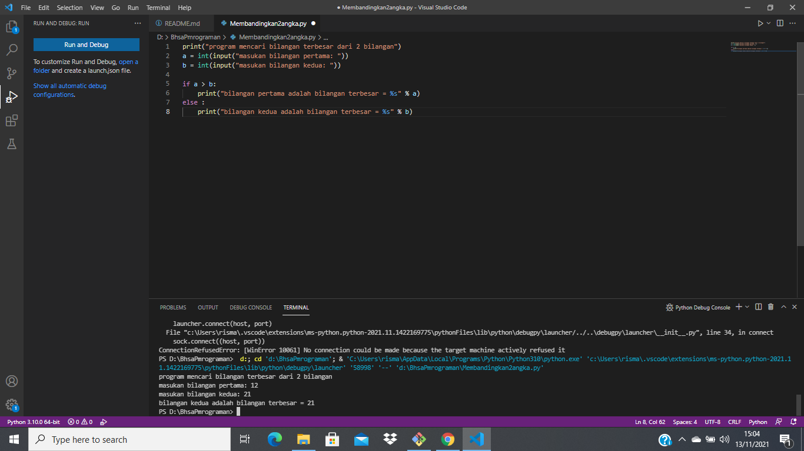
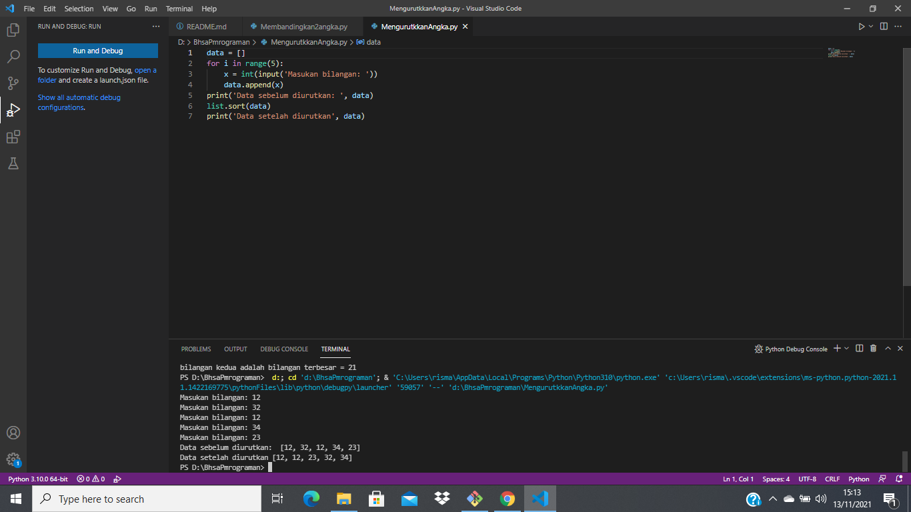
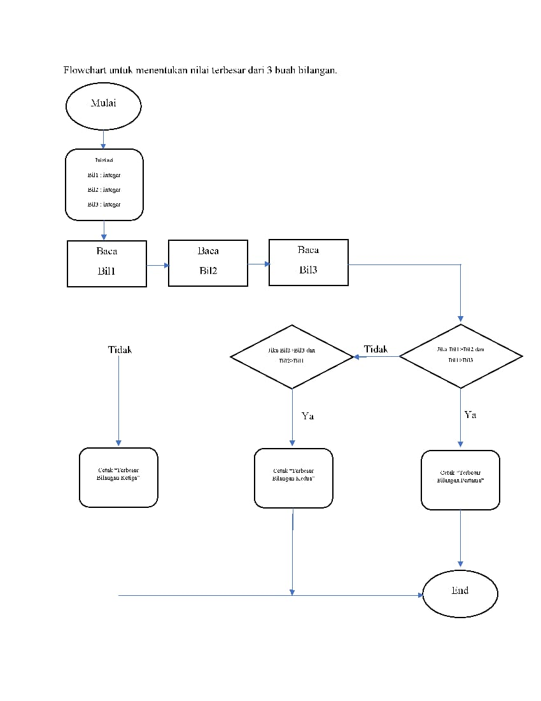
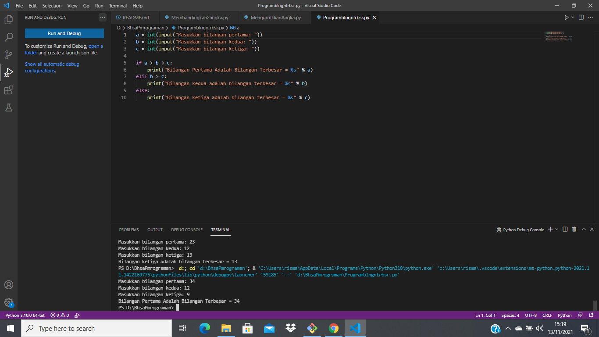
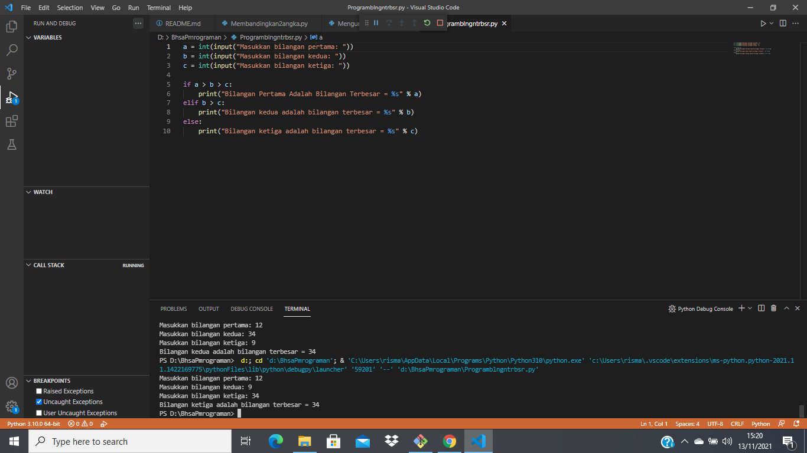
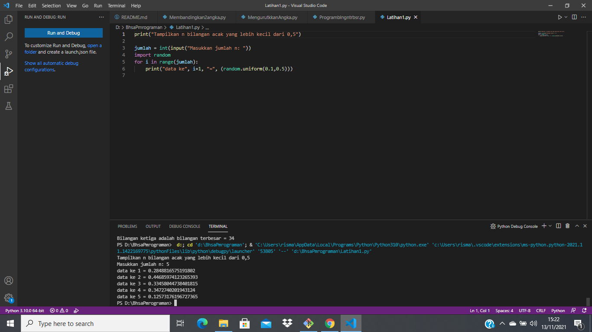
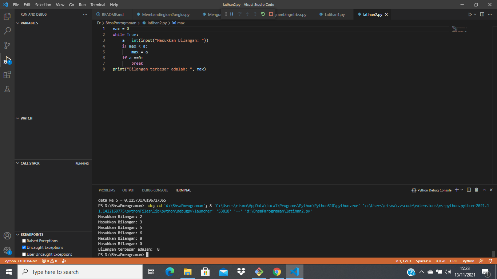
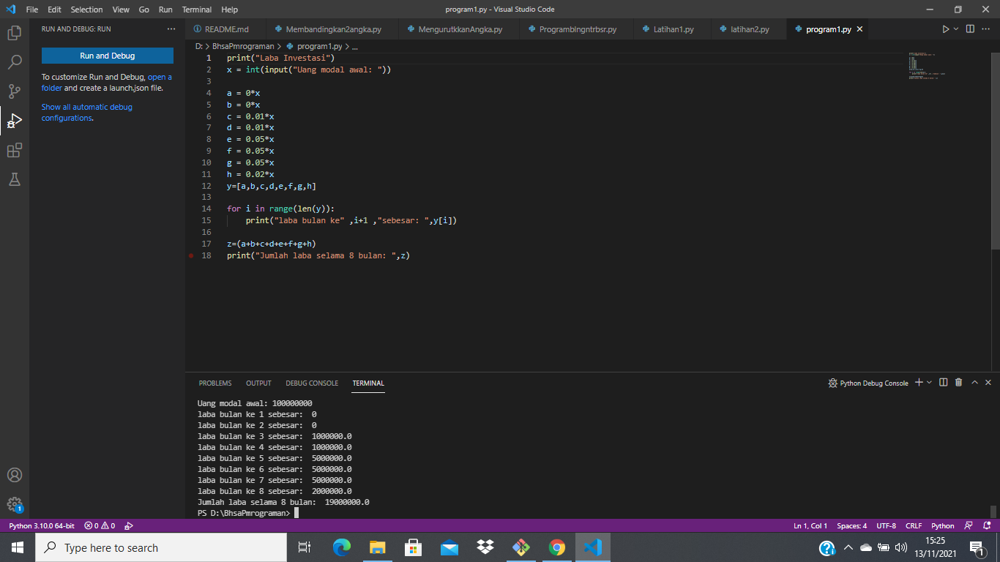

# Labspy02-03

## struktur data
### ini contoh program membandingkan dua angka

### ini contoh program mengurutkan data

## Labspy 02
### ini contoh program membandingkan tiga angka
### berikut bentuk flowchart nya 

### dan berikut beberapa contoh outputnya

## Labspy 03
### program menampilkan n bilangan acak yang lebih kecil dari 0.5

### Program menentukan bilangan terbesar sampai di input bilangan 0

### Program Menghitung Laba berdasarkan skenario yang di tentukan
